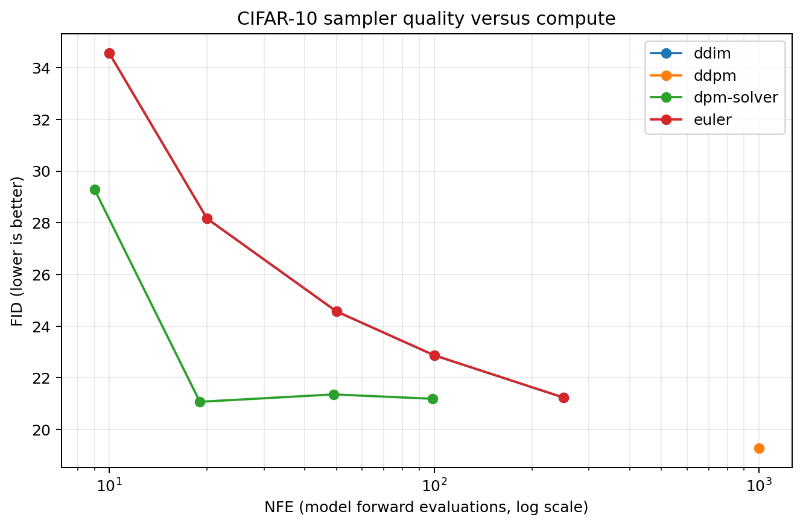
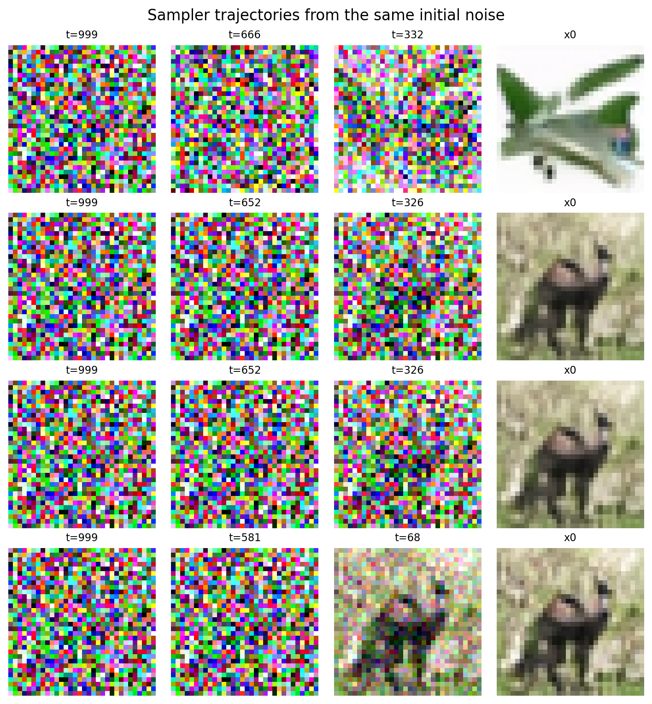
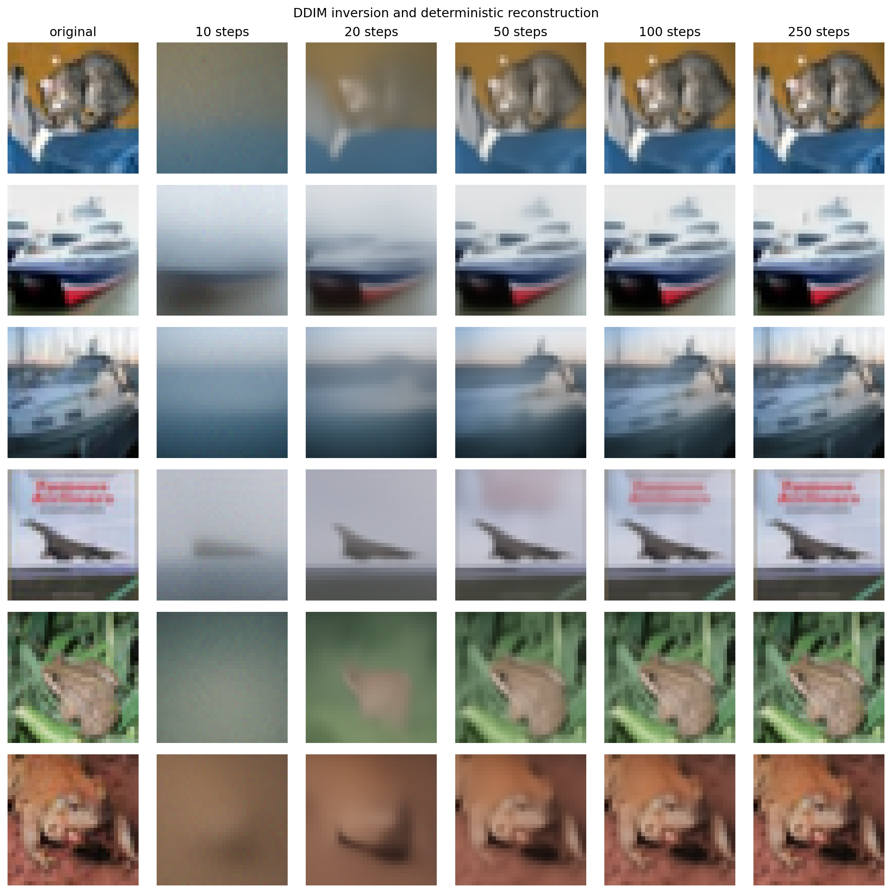

# Project 2 report: sampler comparison

> Implementation, theory, and formal AutoDL measurements are complete. All
> values below come from the recorded JSON artifacts.

## 1. Experimental protocol

- Model: Project 1 CIFAR-10 linear-schedule seed-44 checkpoint, EMA weights.
- Real FID set: the first fixed 5,000 CIFAR-10 training images, without random
  augmentation.
- Generated set: 5,000 images per configuration, seed 42 reset before every
  configuration.
- Data range: training and sampling in `[-1,1]`; FID inputs converted to RGB
  `uint8` in `[0,255]`.
- Compute: AutoDL NVIDIA RTX 4090 (24,564 MiB), Python 3.12.3, PyTorch
  2.8.0+cu128, CUDA 12.8.
- Checkpoint SHA256: `937853559a1377660f7d4cbd1dd3f7c6cf022aed4ab84e9daa918aa6e34541412`.
- AutoDL repository commit: `e8f8af6698570485b9909ca1755f0266a09e4da8`;
  weights were loaded from the nested EMA state.

## 2. DDIM derivation and implementation

The trained model predicts the forward noise in

\[
x_t=\sqrt{\bar\alpha_t}x_0+\sqrt{1-\bar\alpha_t}\epsilon.
\]

Solving this expression for the clean image gives

\[
\hat x_0(x_t)=
\frac{x_t-\sqrt{1-\bar\alpha_t}\epsilon_\theta(x_t,t)}
{\sqrt{\bar\alpha_t}}.
\]

For arbitrary adjacent members `t > t_prev` of a skipped timestep sequence,

\[
\sigma^2=
\eta^2\frac{1-\bar\alpha_{t_{prev}}}{1-\bar\alpha_t}
\left(1-\frac{\bar\alpha_t}{\bar\alpha_{t_{prev}}}\right),
\]

\[
x_{t_{prev}}=
\sqrt{\bar\alpha_{t_{prev}}}\hat x_0+
\sqrt{1-\bar\alpha_{t_{prev}}-\sigma^2}\epsilon_\theta+
\sigma z.
\]

The implementation clamps square-root arguments at zero, protects division by
small `alpha_bar`, and clips generated clean-image predictions to `[-1,1]`.
When `eta=0`, it does not request random noise.

## 3. FID versus NFE

| Sampler | Steps | True NFE | FID | Sampling time |
|---|---:|---:|---:|---:|
| DDPM | 1000 | 1000 | 19.290 | 1010.7 s |
| DDIM | 10 | 10 | 34.555 | 10.1 s |
| DDIM | 20 | 20 | 28.159 | 20.1 s |
| DDIM | 50 | 50 | 24.574 | 50.9 s |
| DDIM | 100 | 100 | 22.875 | 100.6 s |
| DDIM | 250 | 250 | 21.241 | 251.9 s |
| Euler | 10 | 10 | 34.555 | 10.1 s |
| Euler | 20 | 20 | 28.159 | 20.3 s |
| Euler | 50 | 50 | 24.574 | 50.4 s |
| Euler | 100 | 100 | 22.875 | 100.9 s |
| Euler | 250 | 250 | 21.241 | 251.4 s |
| DPM-Solver-2 | 5 | 9 | 29.295 | 9.3 s |
| DPM-Solver-2 | 10 | 19 | 21.074 | 19.3 s |
| DPM-Solver-2 | 25 | 49 | 21.361 | 49.4 s |
| DPM-Solver-2 | 50 | 99 | 21.192 | 100.5 s |

The same trained network, checkpoint, 5,000 real images, and seed were used for
every point, so changes along a curve measure discretization/solver behavior,
not retraining. DDIM improves steadily as steps increase, from FID 34.555 at
10 NFE to 21.241 at 250 NFE. The reference Euler implementation is the same
deterministic discrete probability-flow update as DDIM with `eta=0`, hence its
values match exactly. DPM-Solver-2 is strongest at low compute: 21.074 FID at
19 NFE, close to the 250-NFE DDIM result and substantially better than DDIM at
20 NFE. DDPM reaches the best absolute FID (19.290), but requires 1,000 NFE.

## 4. Trajectories

Measurements are in `runs/trajectory_comparison.json`. All rows use the same
initial noise (`same_initial_noise=true`) and real timestep labels. At 50
outer steps, DDPM uses 1,000 NFE and has mean step L2 5.255; DDIM/Euler use 50
NFE and have mean step L2 1.131; DPM-Solver-2 uses 99 NFE and has mean step L2
1.123. DDPM is stochastic after initialization, whereas the other selected
configurations are deterministic.

## 5. DPM-Solver-2

With \(\lambda=\log(\alpha/\sigma)\), the linear part of the diffusion ODE is
integrated analytically. The implementation evaluates the network at the source
and at the nearest discrete lambda midpoint, then applies the exponential
midpoint update. A run with `S` outer steps uses `2S-1` network evaluations,
because the final clean-image projection needs only one evaluation.

The formal comparison shows that the second-order midpoint correction is most
useful in the low-NFE regime: DPM-Solver-2 improves from FID 29.295 at 9 NFE to
21.074 at 19 NFE, then plateaus around 21.2 at 49–99 NFE. The 25-step point is
slightly worse than the 10-step point (21.361 versus 21.074), a finite-model
and discrete-grid effect rather than evidence that more evaluations always
improve a fixed-seed FID. The true model-call count is `2S-1`, recorded in both
the benchmark JSON and the sampler self-test.

## 6. DDIM inversion

Inversion walks the exact sampling timestep sequence in reverse and approximates
the unavailable target-time noise with the prediction at the current state. Both
inversion and reconstruction disable clean-image clipping so clipping does not
artificially break the round trip.

The evaluation used CIFAR-10 test indices 0–63 and disabled clipping during the
round trip. Results from `runs/inversion_results.json` are:

| Steps | Mean L2 | MAE | MSE | PSNR |
|---:|---:|---:|---:|---:|
| 10 | 18.2820 | 0.26955 | 0.11417 | 15.891 dB |
| 20 | 12.5195 | 0.18369 | 0.05343 | 19.175 dB |
| 50 | 5.0287 | 0.07314 | 0.00864 | 27.057 dB |
| 100 | 2.3665 | 0.03419 | 0.00197 | 33.644 dB |
| 250 | 0.9316 | 0.01332 | 0.00032 | 41.836 dB |

The error is monotonic and falls sharply as the number of inversion steps
increases. More steps reduce local truncation error enough to dominate the
accumulation of model-prediction error for this checkpoint and timestep policy.

## 7. Required questions

### 7.1 Why is DDIM deterministic?

At `eta=0`, \(\sigma=0\) and the update contains no newly sampled `z`. Therefore
the same model, schedule, timestep sequence, weights, and initial \(x_T\) define
the same mathematical output. Exact bitwise repeatability on GPU additionally
requires deterministic kernels and a fixed software/hardware environment.

### 7.2 How should 100 DDIM timesteps be selected for a cosine-trained model?

Uniform integer indices do not represent equal changes in noise level, and a
cosine schedule distributes \(\bar\alpha_t\) differently from a linear schedule.
The principled choice is to space inference points by log-SNR (or equivalently
match target noise levels through \(\bar\alpha_t\)) and map them back to unique
discrete training indices. Reusing the same integer indices is legal but does not
give the same numerical resolution along the denoising path.

### 7.3 Why does changing eta change quality?

`eta` trades a deterministic ODE-like trajectory for stochastic ancestral
updates. Injected noise can increase trajectory diversity, but with few large
steps it also adds variance that the limited remaining updates cannot fully
remove. Consequently `eta=0` commonly gives better low-step fidelity, while
positive eta can be valuable when diversity is preferred.

### 7.4 Why does the DDIM update reduce to DDPM?

For consecutive steps and

\[
\sigma_t^2=\tilde\beta_t=
\frac{1-\bar\alpha_{t-1}}{1-\bar\alpha_t}\beta_t,
\]

substitute
\(\hat x_0=(x_t-\sqrt{1-\bar\alpha_t}\epsilon_\theta)/
\sqrt{\bar\alpha_t}\) into the DDIM mean. Collecting the coefficients of
\(x_t\) and \(\epsilon_\theta\) yields

\[
\mu_\theta=
\frac{1}{\sqrt{\alpha_t}}
\left(x_t-\frac{\beta_t}{\sqrt{1-\bar\alpha_t}}
\epsilon_\theta\right).
\]

The remaining random term is \(\sqrt{\tilde\beta_t}z\), exactly the DDPM
ancestral update. This equivalence assumes consecutive steps and no extra
clean-image clipping; skipped `eta=1` updates are DDPM-like rather than the
original DDPM Markov chain.
