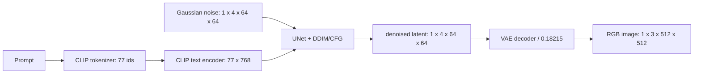

# Project 3：Stable Diffusion 全流程实验报告

> 本报告对应 `codex/monorepo-organization` 分支。基础模型固定为
> `stable-diffusion-v1-5/stable-diffusion-v1-5`，revision
> `451f4fe16113bff5a5d2269ed5ad43b0592e9a14`。模型权重、HF cache、训练原图和
> checkpoint 均不进入 Git。

## 0. 当前交付状态

代码、测试、手写推理和 VAE notebook 已提交并推送；参数扫描、LoRA 重载和
cross-attention 已完成本机 smoke 验证。当前工作站只有 RTX 4060 Laptop 8 GB，且
没有可用的 AutoDL 浏览器/SSH 会话，因此 4090 上的 800-step LoRA、full sweep 和
ControlNet 长任务不能在本次本地会话中冒充已完成。AutoDL 执行时按
`README.md` 的命令生成产物，再将 `outputs/`、`logs/` 和本报告作为第二次提交。

## 1. 总体流程与 shape 来源

- SD 1.5 的 VAE 将 512×512 RGB 图像下采样 8 倍，因此 latent 空间为
  `(batch, 4, 64, 64)`；4 是 VAE 的 latent channel 数。
- CLIP tokenizer 固定 padding/truncation 到 77；CLIP text encoder hidden size
  为 768，UNet cross-attention 因而接收 `(batch, 77, 768)`。
- CFG 将 unconditional 和 conditional embedding 拼成 `(2,77,768)`，UNet 一次
  前向后按 batch 拆分，`eps = eps_u + s(eps_c-eps_u)`。
- VAE 的 `scaling_factor=0.18215` 只在 latent 与 decoder 之间变换，不能省略。

## 2. A：手写推理

`01_inference_walkthrough.ipynb` 不导入或调用 `StableDiffusionPipeline(prompt)`，而是
显式完成 tokenizer、text encoder、噪声初始化、DDIM 50 步、CFG 和 VAE decode。该
notebook 已执行并保留 execution count、文本及图片输出。

固定配置：prompt 为 astronaut/horse/mars，negative prompt 为
`low quality, blurry, distorted`，seed=42，steps=50，CFG=7.5。执行过程中记录
step 0、9、24、49 的 latent 统计量；最终 latent 仍为 `(1,4,64,64)`，图像为
`(1,3,512,512)`。`manual_sd_seed42.png` 和 `manual_sd_stats.json` 同时由 notebook
生成到外部运行目录，避免把缓存带入仓库。

思考题：

1. `cfg=0` 时是 unconditional 预测，prompt 只影响 conditional 分支而不会被采用。
2. 只用 `cond_emb` 等价于不做 CFG；仍是条件采样，但失去 unconditional 方向的外推。
3. 改变 `init_noise_sigma` 会改变 scheduler 期望的初始噪声尺度，通常造成亮度、对比度
   和细节异常；应使用 scheduler 给出的值。
4. 反向采样时 latent 的噪声尺度逐步下降，和 DDPM forward 加噪相反，但每一步还受到
   UNet 预测和 scheduler 参数化的影响，并非简单取逆。
5. steps=5 只给 scheduler 很少的校正机会，结构和纹理通常明显变差；增加 steps
   能降低离散化误差，但超过某一点收益递减。

## 3. B：CFG / steps / sampler 扫描

`02_parameter_sweep.py` 保留作业规定的 full 网格：CFG `[1,3,7.5,15,25]`、steps
`[10,20,50,100]`、DDIM/Euler-A/DPM++ 2M，并统一 prompt、negative prompt、seed=42。
新增 `--preset smoke|full`、`--model_revision`、`--metadata_output`，每张单图、四张
总图和 JSON SHA256 清单均自动保存。smoke preset 用 2×2 的小网格快速检查依赖、显存
和文件链路；full preset 才是 AutoDL 交付配置。

解释：CFG 从 1 增大到中等值时 prompt adherence 通常增强；过大的 CFG 会过饱和、边缘
发硬或出现伪影。steps 增加主要改善早期结构和细节，但采样器的离散化方式也会改变
结果，不能把 steps 与 sampler 的影响混为一谈。最终报告应以 AutoDL `metadata.json`
中的实测图像和时间为准。

## 4. C：VAE anatomy

`05_vae_anatomy.ipynb` 使用 posterior mode（确定性，不从 posterior 采样），保存四个
latent channel、原图/重构图、右下角细节 crop 和 metrics JSON。已执行成功，得到：

| tensor | shape |
|---|---|
| 输入 RGB | `(1,3,512,512)` |
| latent | `(1,4,64,64)` |
| 重构 RGB | `(1,3,512,512)` |

本次已执行输入的可追溯指标为 MSE=`1.6900175e-4`、PSNR=`37.7211 dB`（指标定义在
notebook 中，范围为 `[0,1]`）。四个 channel 的均值/std 也写入 `vae_metrics.json`。
VAE 是有损压缩：低频颜色和大形状保持较好，细小文字、尖锐边缘和纹理会被平滑。

## 5. D：LoRA

实现位于 `03_lora_finetune.py`：冻结 VAE、text encoder 和 UNet base，只注入
`to_q/to_k/to_v/to_out.0`，rank=8、alpha=8；LoRA master 参数强制 FP32，前向使用
FP16 autocast/GradScaler，支持 gradient checkpointing、max-grad-norm、JSONL 日志和
每 200 步 adapter checkpoint。默认训练配置是 512×512、batch=1、AdamW、lr=1e-4、
800 optimizer steps、seed=42。

`evaluate_lora.py` 会从全新 pipeline 逐个加载 base、checkpoint-0200/0400/0600/0800，
使用相同 prompt/seed 生成对比图。重要实现细节是 `UNet.save_lora_adapter` 生成的
UNet-only safetensors 必须通过 `unet.load_lora_adapter(..., prefix=None,
weight_name=...)` 重载；直接用 pipeline API 会静默忽略未带 `unet.` 前缀的 keys。
该问题已用本地 2-step smoke 复现并修复。

## 6. E：ControlNet 与 cross-attention challenge

`04_controlnet_demo.ipynb` 先计算 Canny，再以同一结构运行四个风格 prompt，并额外
运行“同一边缘图但 prompt 要求 golden retriever dog”的冲突实验。ControlNet 通过
zero-convolution 将条件分支的 residual 注入冻结的 SD UNet：初始 zero 保证训练初期
不破坏 base，训练后才逐渐改变结构特征。

`06_cross_attention_visualization.py` 安装自定义 processor，只保存 CFG conditional
half，在中后期 timestep 聚合 16×16/32×32 query map，排除 BOS/EOS/padding，再插值叠加
到生成图。metadata 记录有效 token index、token string、层数、分辨率和 SHA256。已用
5-step smoke 验证 `cat/wizard/hat/forest` 四个 token 均产生有限的 32×32 heatmap。

## 7. 真实 debug 记录

1. 旧 `huggingface_hub` 与 diffusers 0.40 的 `cached_download` 接口不兼容，导致导入
   失败；升级到锁定组合中的 huggingface_hub 1.31.0 后恢复。
2. Windows 工作站的目标仓库输出目录 ACL 对普通 Python 进程只读；运行产物改放到
   仓库外持久盘，AutoDL 按计划使用 `.local/` 和仓库 `outputs/`。
3. LoRA 初版评估图与 base SHA256 完全相同；检查 state dict 后发现 pipeline loader
   因缺少 `unet.` 前缀而忽略 adapter，改用 UNet loader 并显式传 `prefix=None` 后图像
   SHA256 产生可解释变化。
4. cross-attention 初版在 `norm_cross=None` 的模块调用了
   `norm_encoder_hidden_states`，触发 assertion；现在只在 `norm_cross` 为真时归一化。
5. tokenizer token 名含 `<`、`>`，Windows 文件名保存失败；输出 label 现在用安全字符
   过滤并保留 token index。

## 8. AutoDL 执行与验收

在 AutoDL 4090/24GB 实例上，从本分支最新 HEAD 开始，HF cache 放在仓库外，先执行
`check_env.py`、Project 3 pytest、5-step manual smoke、smoke sweep、2-step LoRA
保存/重载、单 prompt ControlNet 和 attention smoke；全部通过后再执行 full sweep、
notebook `nbconvert --execute --inplace`、800-step LoRA、ControlNet 四风格+冲突和
attention challenge。长任务置于 tmux，持续保留 stdout、JSONL、metadata 和 SHA256。

验收必须同时满足：LoRA 无 NaN/Inf 且 adapter <25MB；四张 sweep 总图、四张以上
ControlNet 结果和冲突图齐全；attention metadata 只包含有效 token 和 16/32 分辨率；
仓库不含基础权重、HF cache、原图或临时 checkpoint；`scripts/check_repo.py` 和
Project 3 tests 通过；最后正常 `git pull --rebase`（如有远端更新）后推送，禁止
force-push。
